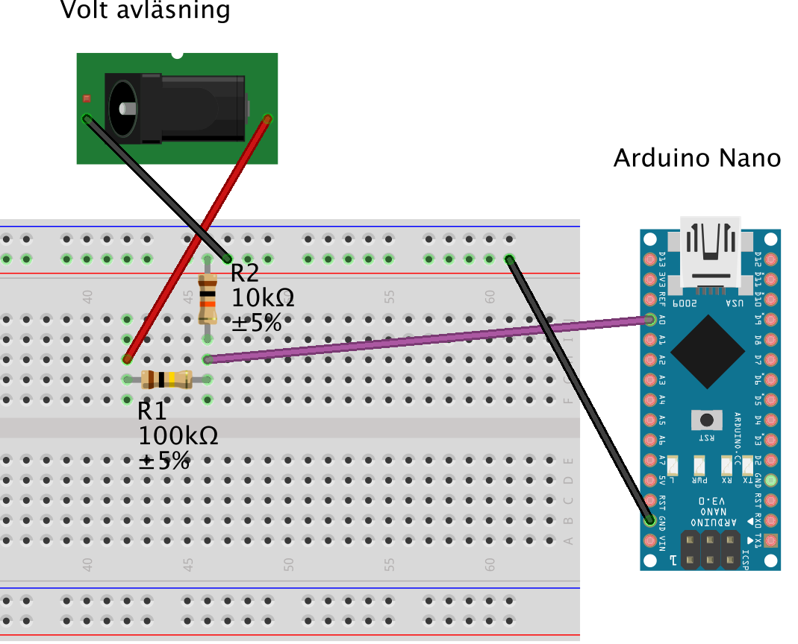

# Arduino voltmätare åt Raspberry Pi
Denna voltmätare avläser batteriet och skickar sedan in via USB porten till raspberry pi datorn dess värde.
Det krävs lite el kunskaper för att du ska kunna få detta att fungera, och läs aldrig av volt styrkor högre än 55v

Det krävs två resistorer för att få detta att fungera.
1 st på 100 k ohm samt 1 st på 10 k ohm
Avläs resistans värdet på dom två och ange det i skriptet. Har du inte det exakta resistans värdet så blir avläsningen fel.

Sedan måste du mäta mellan jord och 5v på din arduino. Om mätaren anger 4.9 eller 4.8 så skall du i skriptet byta ut 5.0 med det värdet.
Det är också viktigt för att du ska få ett exakt värde.

Avläsning i din Raspberry pi sker genom att du ansluter din arduino via USB i din Raspberry Pi och använder serial för att avläsa.

Lycka till!
